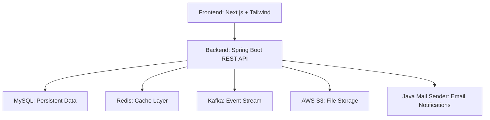

# Secure and Scalable File Storage Backend

A modern Google Drive–style cloud storage app built with **Next.js (React)** and **Spring Boot**. It focuses on smooth uploads, secure file sharing, and instant previews powered by **AWS S3**.

---

## Overview

**SimplyShare** helps users store, organize, and share files in a simple and secure way.

* Upload and manage files and folders
* Share files with other users via email
* Preview images, videos, and PDFs in the browser
* Track storage usage and manage account settings

---

##  Tech Stack

 <h2> Backend Stack</h2>

  

| **Layer** | **Technology** | **Purpose** |
| :-------: | :------------- | :----------- |
| **Language** | **Java 21+**  | Core backend language |
| **Framework** | **Spring Boot 3.5.4**  | REST APIs, configuration, DI |
| **ORM** | **Spring Data JPA + Hibernate**  | Database mapping & queries |
| **Database** | **MySQL**  | Store users, folders, and file metadata |
| **Cache** | **Redis**  | Cache frequent reads for faster access |
| **Asynchronous**  communication  | **Apache Kafka**  | Asynchronous event-driven processing |
| **Security** | **Spring Security (Session-based)**  | Authentication & session management |
| **Email Notification** | **Java Mail Sender**  | Notification & file-sharing emails |
| **Storage** | **AWS S3**   | File storage using pre-signed URLs |
| **Build Tool** | **Maven**  | Build automation & dependency management |
| **Utilities** | **Lombok**  | Reduces Java boilerplate |
| **Documentation** | **Swagger**  | Interactive API documentation |
| **Testing** | **Postman**  | API testing & workflow automation |

  

 <h2> Frontend Stack</h2>
  
  

| **Technology** | **Purpose** |
| :------------- | :----------- |
| **Next.js 15+**  | React framework for SSR and routing |
| **Tailwind CSS**  | Utility-first styling |
| **Axios**  | API calls to backend |

---

## System Architecture
> **Architecture note:** The project currently uses a **monolithic architecture**, implemented in a modular way so it can be split into **microservices** later if needed.

---

Backend handles authentication, validation, metadata management, caching, and delegates file storage to S3 via pre-signed URLs. Kafka is used for background jobs (logs, notifications), Redis for caching, and MySQL for persistent metadata.

## Key Features

|          Section | Feature Highlights                                                                                                                                                                                   |
| ---------------: | :--------------------------------------------------------------------------------------------------------------------------------------------------------------------------------------------------- |
|         **Home** | - See last used files and folders    - Quick sidebar/menu for navigation    - “New” button for fast actions    - Toggle list/grid views    - Inline actions: rename, move, share, delete |
|     **My Drive** | - Browse folders and files like a file explorer    - Intuitive tree structure and breadcrumbs                                                                                                     |
|       **Recent** | - Access recently used files instantly    - Switch between list and grid view                                                                                                                     |
|       **Upload** | - Drag-and-drop or browse to select files    - Instant upload with dedicated button    - Preview after upload    - Upload progress tracking                                                 |
|        **Trash** | - View deleted files (recycle bin)    - Restore or permanently delete files                                                                                                                       |
|      **Profile** | - View and update profile    - Check storage usage and stats    - Upload/profile picture    - Update password and enable 2FA                                                                |
|        **Share** | - Share files by entering recipient email    - Generate secure links and revoke access                                                                                                            |
| **Subscription** | - See current plan details    - Upgrade/downgrade plans    - View invoices and billing info                                                                                                    |
|    **Previewer** | - Preview images and play videos inline    - View & edit PDFs with annotations, text, drawing    - Download edited/previewed files without extra software                                      |

---

## Security

|         Aspect | Details                                                                        |
| -------------: | :----------------------------------------------------------------------------- |
| Authentication | Session-based auth using Spring Security; secure cookie + server session store |
|      Passwords | Stored hashed with BCrypt; server-side validation on change/reset              |
|  Authorization | Role-based checks on endpoints and UI (admin vs user)                          |
|   Input Safety | Request validation, size limits,                      |
| Session Safety | HttpOnly secure cookies, same-site policy, session expiry and invalidation     |

---

## Performance & Scalability

|       Optimization | Benefit                                                    |
| -----------------: | :--------------------------------------------------------- |
|      Redis caching | Lowers DB load, speeds repeated reads                      |
| Kafka event stream | Offloads heavy jobs (emails, logs) from request path       |
| S3 pre-signed URLs | Frontend uploads directly to S3 — reduces server bandwidth |
| HikariCP (DB pool) | Efficient DB connections and stable throughput             |

---

## Project Info

 <h2 align="center">
 
   SimplyShare</b> — A cloud storage platform inspired by Google-Drive
   
</h2>
   

<table>
  <tr>
    <th> Duration</th>
    <td><b>4 weeks</b> (Full Backend + Frontend Development)</td>
  </tr>
  <tr>
    <th> Tech Stack</th>
    <td><b>Spring Boot · MySQL · Redis · Kafka · AWS S3 · Next.js</b></td>
  </tr>
  <tr>
    <th> Live Demo</th>
    <td><a href="https://simplyshare.projectswithsurja.dev" target="_blank">simplyshare.projectswithsurja.dev</a></td>
  </tr>
  <tr>
    <th> Deployment</th>
    <td><b>AWS EC2</b> for backend · <b>Vercel</b> for frontend</td>
  </tr>
</table>

This is a personal practice project to learn and apply modern full-stack and backend technologies. The design is intentionally modular so the monolith can be split into microservices later.

---

*Thank you — SimplyShare*
